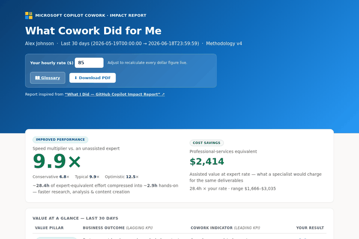
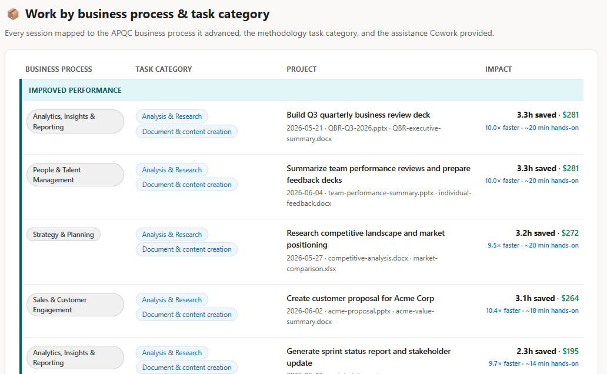
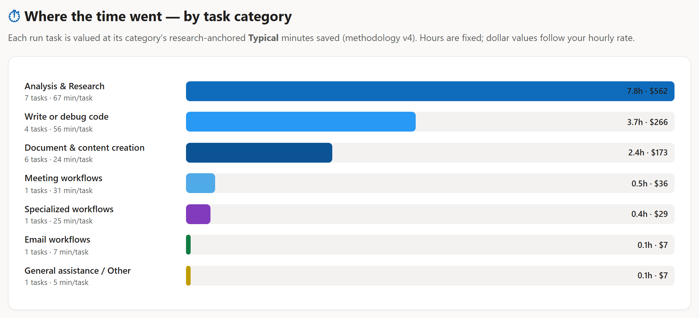

# What Cowork Did for Me

> A personal impact report skill for **Microsoft Copilot Cowork** — quantifies your leverage as research-anchored **time saved**, its **professional-services-equivalent value**, and the **real Copilot-credit cost** (so you get an actual ROI).



---

## Get Started in 4 Steps

1. **Download** [`cowork-roi-report-skill-v20.zip`](../../releases/latest) from the latest release. *(No need to unzip — attach it as-is.)*
2. **Open** a new [Copilot Cowork](https://copilot.cloud.microsoft/cowork) session.
3. **Click the ➕ (plus) symbol** to attach the zip file, then send this prompt:

   > **Add this skill.**

4. Once it's added, ask:

   > **Generate my impact summary report.**

   It'll ask one quick question — which period to measure (**7, 15, or 30 days**) — then build your report.

That's it. 🎉

---

## What you get out of it — your leverage, quantified

**With Cowork, you operate like a multidisciplinary team.** You steer; Cowork brings in best-in-class experts from across fields, produces quality output, and does it at a pace far beyond what humans alone could match. This skill makes that leverage visible and defensible across three dimensions:

- **⚡ Speed** — the **time saved**, anchored entirely in published research: for each task category, the per-run expert band × the number of runs Cowork executed (conservative / typical / optimistic). A **speed multiplier** rides alongside as a secondary, directional read on how much faster you moved.
- **🎯 Quality** — the kind of **expert-grade outputs** Cowork helped you ship: analyst-style research syntheses, executive decks and documents, interactive dashboards and apps, scripts, and polished communications — each traced to a real artifact you produced.
- **🧠 Expert assistance** — the professional **skills Cowork put to work for you** — Presentation Design, Technical Writing, Data Analysis, Financial Modelling, Frontend Development, and more — rolled up into a **professional-services-equivalent dollar value** at your hourly rate.
- **💳 Real cost & ROI** — your **actual Copilot-credit cost** read live from Cowork's `/cost` (credits × 1¢ GA list), shown per session and rolled into an **ROI banner**: research-anchored value ÷ real cost, with the return multiple and net %. **Cost data requires running in the web app** ([m365.cloud.microsoft/agents/cowork](https://m365.cloud.microsoft/agents/cowork)) — if you run the skill in the **desktop app, cost data is not available** (the report still renders everything else).

Every figure traces back to your own session artifacts in OneDrive — nothing is invented, the cost is read live (never estimated), and categories with no work in the window report zero. The result is a credible, shareable answer to *"What has Cowork actually done for me?"*

---

## What is this?

**"What Cowork Did for Me"** is a skill for [Copilot Cowork](https://copilot.cloud.microsoft/cowork) that generates a polished **single-file HTML report** from your own Cowork session history stored in OneDrive. It answers the question: *"How much time and value has Cowork given me?"*

The skill:
- Harvests your Cowork session artifacts (inputs analyzed & outputs produced) from OneDrive — across **all three** `Documents/Cowork/` folder layouts, counting **only items created by the Cowork app** so unrelated activity (e.g. M365 Copilot/Scout) is excluded (see [Harvest scope](#harvest-scope--what-counts-as-cowork-activity))
- Classifies work into 8 research-anchored task categories
- Computes research-anchored **time saved** as **Σ runs × per-run band**, then values it at your hourly rate
- Reads your **real Copilot-credit cost** live from `/cost` and reports an actual **ROI** (value ÷ cost)
- Renders a self-contained, interactive HTML report you can share or print to PDF

Inspired by [microsoft/What-I-Did-Copilot](https://github.com/microsoft/What-I-Did-Copilot), adapted for Copilot Cowork.

---

## Harvest scope — what counts as Cowork activity

The report measures **only Cowork** work, by **allow-list** — not by trying to recognise and subtract everything else *(new in v18)*:

- **Reads only `Documents/Cowork/`**, across **all three** folder layouts the product has used: `Tasks/<goal>-<date>/`, root `<goal>-<date>/`, and legacy `sessions/<uuid>/` (each with `input/` + `output/`). Earlier versions only read the legacy layout and under-counted recent work.
- **Counts only items created by the Cowork app** (`createdBy.application.id = 6ab48b67-…`) — the same product app id for every user and tenant, so it needs no per-user configuration.
- **Never enumerates `Documents/Apps/…`.** That tree is the **M365 Copilot app running Scout** (scheduled heartbeats, monitors, executive briefings) — *not* Cowork — and is excluded automatically, with no instance-specific name list to maintain.

Why allow-list, not deny-list: a "find Scout and remove it" rule keys on instance names that differ per user and break on the next account. Scoping *positively* to Cowork-app-created artifacts generalises cleanly.

---

## Report Highlights

### Time Saved, Value & ROI
The report leads with research-anchored **Time Saved** — for each task category, the per-run expert band × the number of runs Cowork executed (conservative / typical / optimistic) — and its **professional-services-equivalent Value** at your hourly rate. A **ROI banner** sets that value against your **real Copilot-credit cost** (read live from `/cost`), showing the return multiple (value ÷ cost) and net %. A **speed multiplier** appears as a clearly-labelled *secondary, directional* stat (its hands-on denominator is modeled, not a stopwatch). A live hourly-rate control recalculates every dollar figure, and a **Download PDF** button exports the whole thing.


### Value at a Glance
A business-value table maps your impact to the **four value pillars** — **Revenue Growth**, **Cost Reduction**, **Risk Mitigation**, and **Transformation** — each pairing a business outcome (lagging KPI) with a Cowork indicator (leading KPI) and your result. Headline KPIs follow: Cowork sessions, tasks completed, active days, expert-equivalent hours, and your estimated hands-on hours.

### Work by Business Process — two lenses
This section presents one row per **project Cowork delivered** (not task categories), and you **toggle between two lenses**:

- **By Job-to-be-Done** — an indented **Job ▸ Business Process ▸ JTBD ▸ Project** hierarchy (each level chip-labelled), with every project's assistance inline: expert-equivalent hours saved · value · **real credits · $cost** · speed.
- **By Business Value Pillar** — a clean table: **Business value pillar · Project · Assistance offered** (with the same credits·cost detail).

The process/job/JTBD taxonomy is **derived live for whoever runs the report** (from their own Microsoft 365 footprint via the bundled map-my-work playbook) — nothing is hard-coded to any individual; if the playbook isn't run, it falls back to the generic APQC business-process framework. A **Credits · cost column** shows the **real Copilot-credit spend** per session — read live from `/cost` (credits × 1¢ GA list) and never estimated. **Chat-only sessions** (no saved file) are counted too, via telemetry.



### Roles Cowork Assembled for Me
A breakdown of the **exact professional roles a billing firm would charge** for your work — Data Analyst, Management Consultant, Software Engineer, Risk & Compliance Analyst, and more — each **linked to a job-title search** and credited with the expert-equivalent hours it covered. Roles are LLM-tagged per session, with a 16-role keyword taxonomy as fallback. *(Logic ported from [microsoft/What-I-Did-Copilot](https://github.com/microsoft/What-I-Did-Copilot).)*

### Where the Time Went, Skills Augmented & Deliverables
- **By task category** — research-anchored time-savings bars across the 8 categories.
- **Skills augmented** — the professional skills Cowork put to work (Presentation Design, Technical Writing, Data Analysis, Financial Modelling, Frontend Development, …), each with the expert-equivalent hours it covered — turning time saved into *capability* without added headcount.
- **Deliverables & the skills behind them** — every artifact Cowork produced, the skills that went into it, and the expert effort attributed to each.



### Methodology & Glossary
Every number is traceable: an expandable methodology section and glossary explain each band and metric, with clickable links to the published research behind them.

---

## The Four Value Pillars

Every session's impact is expressed in a shared business-value vocabulary, so leverage reads the same way across teams. These four pillars are based on Microsoft's **[OneBVM (One Business Value Model)](https://aka.ms/OneBVM)** methodology:

| Pillar | Type | What it captures |
|---|---|---|
| **Revenue Growth** | Tangible · money coming in | Demand created, converted, and monetised — new opportunities, win rates, pricing, faster deal cycles. |
| **Cost Reduction** | Tangible · money going out | Inefficiencies eliminated, manual work automated, spend optimised — direct savings or capacity redeployed. |
| **Risk Mitigation** | Intangible · losses avoided | Issues detected earlier, controls improved, faster correction — financial, operational, and compliance risk reduced. |
| **Transformation** | Intangible · new ways of working | Better/faster decisions, more responsive operations, stronger collaboration, and greater AI-workflow adoption. |

The pillar for each session is set by an intent-verb rule (the work's job-to-be-done), falling back to the process default — never force-fit. Pillars with no qualifying work in the window render as zero, not hidden.

---

## How to Use

Once installed, trigger the skill by asking Cowork:
- *"What did Cowork do for me?"*
- *"My Cowork ROI report"*
- *"Cowork impact report"*
- *"How much time has Copilot Cowork saved me this month?"*

The skill will:
1. **Ask** which period to measure (7, 15, or 30 days) and whether to automate
2. **Harvest** your Cowork session files from OneDrive
3. **Classify** each session using the deterministic extension-based classifier
4. **Compute** research-anchored Time Saved (Σ runs × band) and Value, attach the real `/cost` credits, and derive ROI + a secondary speed multiplier
5. **Render** a beautiful HTML report
6. **Optionally automate** on a recurring schedule with email digest

---

## Methodology

**Time Saved = Σ runs × band** *(anchored to the Cowork Time-Savings methodology deck)*. For each session, every task category contributes its research-anchored per-run band **× the number of runs** Cowork executed in that category. Each band already bakes in the activity-instance chain inside one run (e.g. `code 56` = write + test + debug; `document 24` = draft → rewrite → format → polish), so the model counts runs and multiplies — it does **not** value code per line or add a separate authoring step (both would double-count the chain).

```
time_saved_min   = Σ_categories  runs[cat] × CATS[cat].typical
Time Saved (hrs) = Σ time_saved_min / 60      # Conservative / Optimistic re-sum the low / high bands
Value            = Time Saved hrs × hourly_rate
```

**Run counts are telemetry-grounded** from the agentic tool-chains: a **code run ≈ 6 code-edit actions**, an **analysis run ≈ 5 research-tool calls**. `mine_session.py` emits a `runs:{category:count}` field; sessions without telemetry use conservative estimates, labeled as such. The run count is the single transparent, auditable lever.

**Real cost & ROI.** Each session's true cost is read live from Cowork's `/cost` (Copilot Credits), priced at **1¢/credit** (GA pay-as-you-go list) — never estimated. The **ROI banner** = research-anchored Value ÷ real cost. **This requires running in the web app — [m365.cloud.microsoft/agents/cowork](https://m365.cloud.microsoft/agents/cowork) — since `/cost` is only readable there; running in the desktop app yields no cost data** (everything else still renders).

**Speed multiplier (secondary, directional).** Dividing Time Saved by a *modeled* hands-on clock gives a speed multiplier. That assisted clock — `8 min + 2 min × (inputs + outputs)`, floor 4 — is the one non-research input (OneDrive can't measure keystroke time), so the multiplier is directional, not a stopwatch (it's *measured* for sessions where the telemetry hook is on):

```
speed_multiplier = Σ time_saved_min / Σ assisted_min        (rate-independent · secondary)
```

### Research-anchored category bands (min saved / run)

| Category | Low | Typical | High |
|---|---:|---:|---:|
| Analysis & Research | 30 | **67** | 92 |
| Document & content creation | 12 | **24** | 42 |
| Email workflows | 3 | **7** | 12 |
| Meeting workflows | 12 | **31** | 43 |
| Communication workflows | 2 | **4** | 11 |
| Specialized workflows | 10 | **25** | 40 |
| Write or debug code | 30 | **56** | 96 |
| General assistance / Other | 2 | **5** | 8 |

Sources: Stanford-WB, Microsoft Research, NBER, Forrester — all clickable in the report's Glossary.

---

## What's in the Skill

```
cowork-roi-report-skill/
├── SKILL.md                    # Skill definition + workflow (loaded by Cowork)
├── README.md                   # Technical documentation
├── CHANGELOG-v20.md            # Latest — plus v5 / v6 / v11 / v13 / v14 / v15 / v16 / v18 / v19 changelogs
├── references/
│   ├── map-my-work-playbook.md # Derives each user's Jobs ▸ Processes ▸ Pillars ▸ JTBD (runs inline)
│   └── value-pillars.md        # Four-pillar (OneBVM) crosswalk (single source of truth)
├── scripts/
│   ├── mine_session.py         # Live-session telemetry (Stop hook); emits runs:{category:count}
│   ├── statusline_cost.py      # Per-session cost capture (statusLine hook)
│   ├── classify.py             # Category + business-process classifier
│   ├── compute.py              # Applies the methodology (Σ runs × band) + real /cost credits → payload JSON
│   ├── build_report.py         # Renders the self-contained HTML report (Credits·cost column, ROI banner)
│   ├── apqc_taxonomy.json      # Generic APQC business-process fallback
│   ├── roles_taxonomy.json     # 16-role keyword fallback for "roles assembled"
│   └── skills_vocabulary.json  # Controlled DOMAIN + TECH skills vocabulary
└── examples/
    └── sample_sessions.json    # Synthetic input (safe to share)
```

No third-party dependencies — **standard-library Python 3 only**.

---

## Caveats

- **Time Saved & Value are research-anchored** (per-run bands × telemetry-grounded run counts). The **speed multiplier's** assisted clock is **modeled**, not measured — OneDrive records artifacts, not keystroke time — so treat the multiplier as **directional**, not a stopwatch.
- **Cost is real, not estimated** — Copilot credits are read live from `/cost` and priced at 1¢ each (GA list). **Cost data is only available when you run the skill in the web app ([m365.cloud.microsoft/agents/cowork](https://m365.cloud.microsoft/agents/cowork)); the desktop app does not expose `/cost`, so cost/ROI is omitted there.** If the browser isn't available (e.g. a headless scheduled run), the last ledgered values are reused or you're asked to paste `/cost`.
- Categories with **no runs** in the window report **zero** — keeping totals a conservative floor.
- Counting stays conservative: supporting files folded into the primary task; iterative versions of an artifact collapse to one deliverable.

---

## License

MIT

---

## Credits

- Inspired by [microsoft/What-I-Did-Copilot](https://github.com/microsoft/What-I-Did-Copilot)
- Powered by [Microsoft Copilot Cowork](https://copilot.cloud.microsoft/cowork)
