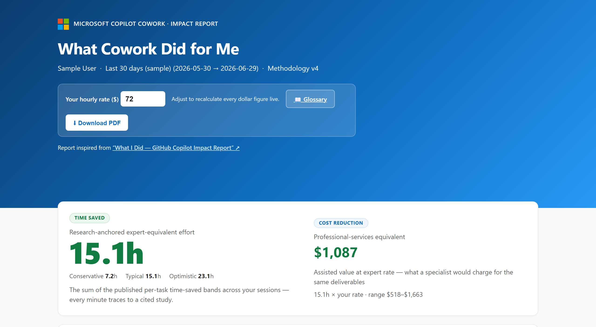
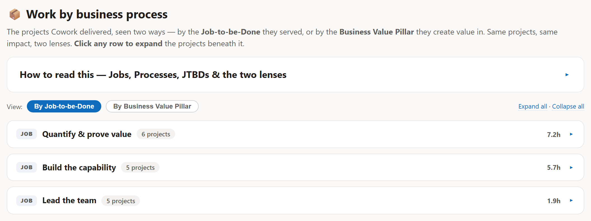

# What Cowork Did for Me

> A personal impact report skill for **Microsoft Copilot Cowork** — it leads with research-anchored **Time Saved** and its **professional-services-equivalent value**, then maps your work to your own Jobs, Business Processes, and the four Value Pillars.



---

## What is this?

**"What Cowork Did for Me"** is a skill for [Copilot Cowork](https://copilot.cloud.microsoft/cowork) that generates a polished, Microsoft-branded **single-file HTML report** from your own Cowork session history stored in OneDrive. It answers the question: *"How much time and value has Cowork given me?"*

The skill:
- Harvests your Cowork session artifacts (inputs analyzed & outputs produced) from OneDrive — scoped to the Cowork app across all three `Documents/Cowork/` layouts
- Classifies each session into research-anchored task categories
- Computes **research-anchored Time Saved** and its **professional-services-equivalent value**
- Maps your work to your own **Jobs ▸ Business Processes ▸ Jobs-to-be-Done** and the **four Value Pillars**
- Renders a self-contained, interactive HTML report you can share or print to PDF

Inspired by [microsoft/What-I-Did-Copilot](https://github.com/microsoft/What-I-Did-Copilot), adapted for Copilot Cowork.

---

## Download

| Version | File | Status |
|---|---|---|
| **v24** | [`cowork-roi-report-skill-v24.zip`](cowork-roi-report-skill-v24.zip) | ✅ **Latest version** — recommended |
| older | [`archive/`](archive) | Previous versions (kept for reference, incl. v23) |

### What's new in v24

v24 makes the **durable taxonomy memory per-user and owner-scoped**, so each person's process and project names come from — and stay with — their own work:

- **Owner-scoped, per-user registry.** The taxonomy registry now lives on the user's own mount (syncing to **their** OneDrive `Documents/Cowork/` folder) under an owner-stamped, per-user filename derived from their email.
- **Identity guard.** `reconcile_taxonomy.py` only uses a registry whose `owner` matches the invoking user; otherwise it starts fresh and mints processes from that user's own sessions. A new `--owner` argument (falling back to the harvested `meta.email`) keeps the registry scoped.
- **Per-run scratch stays out of the bundle.** Overrides are written to `working/process_overrides.json` and read from there; the shipped `scripts/process_overrides.json` ships empty (`{}`) and no registry seed is bundled — a first run starts clean.

Everything else is unchanged from v23: the process-anchored **Process ▸ JTBD ▸ Project** taxonomy, the artifact-scaled two-clock methodology, KPIs, the four-pillar **Value at a glance** table, **Where the time went** by task category, **Roles Cowork assembled**, **Deliverables & the skills behind them**, the activity heatmap, and the methodology glossary with clickable sources. Numbers still come only from `compute.py`. See [`skill/CHANGELOG-v24.md`](skill/CHANGELOG-v24.md) for full details.

---

## Report Highlights

### Time Saved & Value
The report leads with research-anchored **Time Saved** (conservative / typical / optimistic) and a **professional-services equivalent** — what that expert time would cost at your hourly rate.


### KPIs & the four Value Pillars
A **Value at a glance** table crosswalks your work to **Revenue Growth, Cost Reduction, Risk Mitigation, and Transformation**, followed by headline KPIs and the secondary speed multiplier.


### Where the time went — by task category
See where your time went across the research-anchored task categories, each valued at its cited per-task band.


### Work by business process
Your projects, seen two ways — by the **JTBD** they served within their **Business Process**, or by the **Business Value Pillar** they create value in. Same projects, two lenses, all derived from your own footprint at run time.



### Full report sections
- **Hero** — research-anchored Time Saved (conservative / typical / optimistic) + professional-services value
- **KPIs** — sessions, run tasks, deliverables, active days, expert-equivalent hours
- **Value at a glance** — the four Value Pillars with example KPIs
- **Where the time went** — research-anchored time-savings bars by task category
- **Roles Cowork assembled** — the professional roles a billing firm would charge for your work, each linked to a job search
- **Work by business process** — Process ▸ JTBD ▸ Project, toggleable between By-process and Business-Value-Pillar views
- **Deliverables & the skills behind them**
- **Methodology & glossary** — every band traceable, with clickable research sources
- **Live hourly-rate control** — recalculates all dollar figures; the speed multiplier is rate-independent
- **Download PDF** button

---

## Installation

### Option 1 — Let Cowork install it for you (easiest)

1. **Download** the latest version: [`cowork-roi-report-skill-v24.zip`](cowork-roi-report-skill-v24.zip) *(no need to unzip — attach it as-is)*
2. **Open** a new [Copilot Cowork](https://copilot.cloud.microsoft/cowork) session
3. **Click the ➕ (plus) symbol** to attach the zip file, then send:

   > **Add this skill.**

4. Cowork unpacks and places the skill in the right location for you
5. **Done!** In the same session (or a new one), ask: *"Generate my impact summary report."*

### Option 2 — Manual install

1. **Download** the latest version: [`cowork-roi-report-skill-v24.zip`](cowork-roi-report-skill-v24.zip)
2. **Extract** the zip
3. **Copy** the `cowork-roi-report/` folder to your Cowork skills directory:
   ```
   <OneDrive>/Documents/Cowork/skills/cowork-roi-report/
   ```
4. **Done!** Ask Cowork: *"Generate my impact summary report."*

#### Alternative paths
- Cowork container: `/mnt/user-config/.claude/skills/cowork-roi-report/`
- Custom skills folder: wherever your Cowork instance reads personal skills from

---

## How to Use

Once installed, trigger the skill by asking Cowork:
- *"Generate my impact summary report"*
- *"What did Cowork do for me?"*
- *"My Cowork ROI report"*
- *"How much time has Copilot Cowork saved me this month?"*

The skill will:
1. **Ask** two questions — which period to measure (7, 15, or 30 days) and whether to run once or automate + email a recurring digest
2. **Harvest** your Cowork session files from OneDrive
3. **Classify** each session with the deterministic extension-based classifier
4. **Map** your work to Processes ▸ JTBDs ▸ Projects and the four Value Pillars, aligning to your durable taxonomy registry (align-first, create-if-novel)
5. **Compute** research-anchored Time Saved and value
6. **Render** a beautiful, self-contained HTML report

---

## Methodology

**Time Saved (expert-equivalent)** — what a professional would take with no AI — is the **sum of the research-anchored band for each task** in a session. Every minute traces to a cited study.

```
time_saved_min = Σ CATS[task].typical        # e.g. Analysis (67) + Document (24) = 91 min
Time Saved (hours) = Σ time_saved_min / 60
Value              = Time Saved hours × hourly_rate
```

The **speed multiplier** is a secondary, directional stat: Time Saved divided by a *modeled* hands-on clock (`8 min + 2 min × (inputs + outputs)`, floor 4 min). OneDrive can't record keystroke time, so treat the multiplier as directional, not a stopwatch.

### Research-anchored category bands (min saved / task)

| Category | Low | **Typical** | High |
|---|---:|---:|---:|
| Analysis & Research | 30 | **67** | 92 |
| Document & content creation | 12 | **24** | 42 |
| Email workflows | 3 | **7** | 12 |
| Meeting workflows | 12 | **31** | 43 |
| Communication workflows | 2 | **4** | 11 |
| Specialized workflows | 10 | **25** | 40 |
| Write or debug code | 30 | **56** | 96 |
| General assistance / Other | 2 | **5** | 8 |

Sources: Stanford-WB, Microsoft Research, NBER, Forrester — all clickable in the report's Glossary.

---

## What's in the Skill

```
cowork-roi-report/
├── SKILL.md                     # skill definition + workflow (loaded by Cowork)
├── README.md                    # technical documentation
├── CHANGELOG-v24.md             # latest — per-user, owner-scoped taxonomy memory
├── CHANGELOG-v23.md             # Process-anchored taxonomy + durable taxonomy memory
├── CHANGELOG-v5…v22.md          # full version history
├── scripts/
│   ├── reconcile_taxonomy.py    # align-first/create-if-novel; owner-scoped registry; runs before classify.py
│   ├── classify.py              # deterministic ext→category classifier
│   ├── compute.py               # applies the methodology → payload JSON (now with pct_time)
│   ├── build_report.py          # renders the self-contained HTML report
│   ├── mine_session.py          # mines the live session transcript (telemetry hook)
│   ├── statusline_cost.py       # optional status-line cost helper
│   ├── apqc_taxonomy.json       # generic APQC fallback business-process taxonomy
│   ├── roles_taxonomy.json      # role keyword fallback for "roles assembled"
│   ├── skills_vocabulary.json   # controlled vocabulary for "skills augmented"
│   ├── process_overrides.json   # per-user session→process map (ships empty `{}`; written to working/ at run time)
│   └── process_overrides.example.json  # example override map
├── references/
│   ├── map-my-work-playbook.md  # derives your own Processes ▸ JTBDs ▸ Projects (run inline)
│   └── value-pillars.md         # the four-pillar crosswalk
└── examples/
    └── sample_sessions.json     # synthetic input (safe to share)
```

The **durable taxonomy memory** is a per-user, owner-scoped registry (`~/.claude/cowork-process-registry.<user>.json`, Processes + known Projects) that is read first, aligned to, and persisted every run. It lives on the user's own mount (syncing to their OneDrive `Documents/Cowork/`) and is never bundled with the skill; a first run with no registry starts clean and mints processes from the user's own sessions.

`map-my-work` is **folded in** as a reference playbook — there is no second skill to install, and it runs automatically when the report is generated. No third-party dependencies — **standard-library Python 3 only**.

### Run the scripts directly (dev)

```bash
python scripts/classify.py     --in working/cowork_raw.json      --out working/cowork_sessions.json
python scripts/compute.py      --in working/cowork_sessions.json --out working/cowork_roi_data.json
python scripts/build_report.py --data working/cowork_roi_data.json --out output/cowork-roi-report.html
```

---

## Caveats

- **Time Saved & Value are research-anchored** (cited per-task bands). The **speed multiplier's** assisted clock is a **modeled** estimate, so treat the multiplier as directional.
- Categories with **no tasks** in the window are reported as **zero**, keeping totals a conservative floor.
- Counting stays conservative: supporting files are folded into the primary task.
- Everything is **derived per user at run time** — nothing in the skill is specific to any individual.

---

## License

MIT

---

## Credits

- Inspired by [microsoft/What-I-Did-Copilot](https://github.com/microsoft/What-I-Did-Copilot)
- Powered by [Microsoft Copilot Cowork](https://copilot.cloud.microsoft/cowork)
