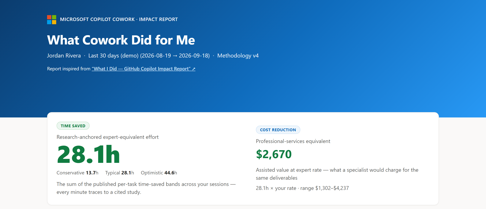
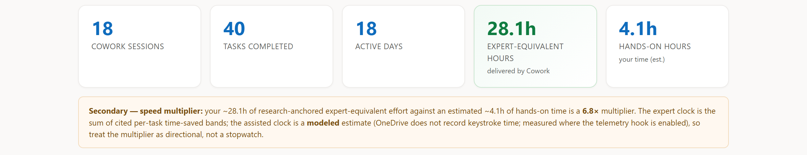
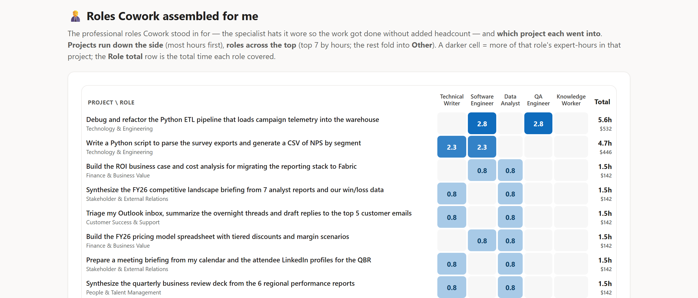
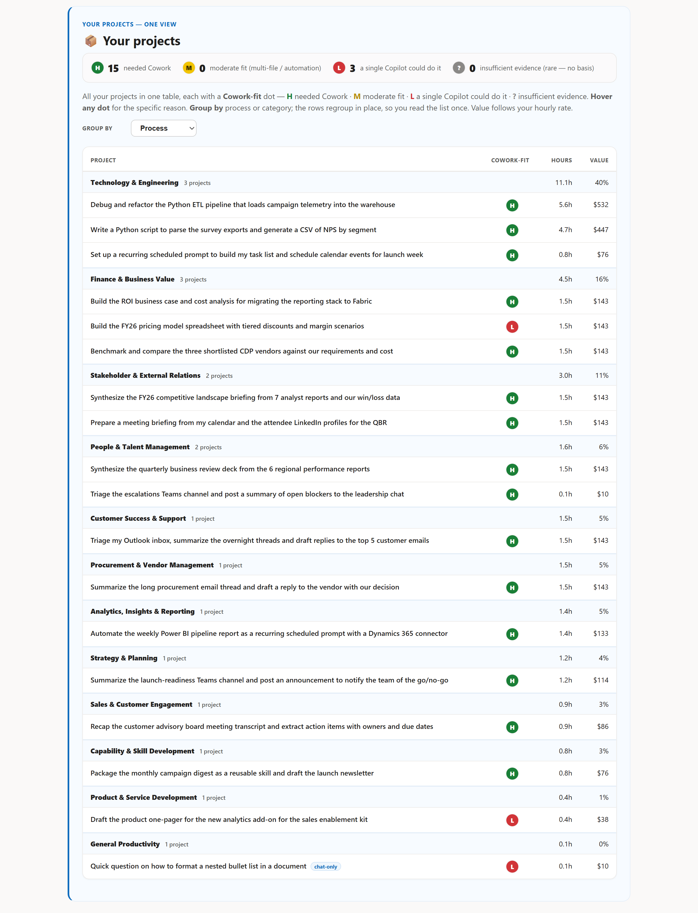

# What Cowork Did for Me

> A personal impact report skill for **Microsoft Copilot Cowork** — it leads with research-anchored **Time Saved** and its **professional-services-equivalent value**, then maps your work to your own Business Processes and Projects and grades each project's **Cowork-fit**.



---

## What is this?

**"What Cowork Did for Me"** is a skill for [Copilot Cowork](https://copilot.cloud.microsoft/cowork) that generates a polished, Microsoft-branded **single-file HTML report** from your own Cowork session history stored in OneDrive. It answers the question: *"How much time and value has Cowork given me?"*

The skill:
- Harvests your Cowork session artifacts (inputs analyzed & outputs produced) from OneDrive — scoped to the Cowork app across all three `Documents/Cowork/` layouts
- Classifies each session into research-anchored task categories
- Computes **research-anchored Time Saved** and its **professional-services-equivalent value**
- Maps your work to your own **Business Processes ▸ Projects** and grades each project's **Cowork-fit** — did it really need Cowork, or could a single in-app Copilot have done it?
- Renders a self-contained, interactive HTML report you can share or print to PDF

Inspired by [microsoft/What-I-Did-Copilot](https://github.com/microsoft/What-I-Did-Copilot), adapted for Copilot Cowork.

---

## Installation

**Let Cowork install it for you (easiest):**

1. **Download** the latest version: [`cowork-roi-report-skill-v40.zip`](cowork-roi-report-skill-v40.zip) *(no need to unzip — attach it as-is)*
2. **Open** a new [Copilot Cowork](https://copilot.cloud.microsoft/cowork) session
3. **Click the ➕ (plus) symbol** to attach the zip file, then send:

   > **Add this skill.**

4. Cowork unpacks and places the skill in the right location for you
5. **Done!** In the same session (or a new one), ask: *"Generate my impact summary report."*

| Version | File | Status |
|---|---|---|
| **v40** | [`cowork-roi-report-skill-v40.zip`](cowork-roi-report-skill-v40.zip) | ✅ **Latest version** — recommended |
| older | [`archive/`](archive) | Previous versions (kept for reference, incl. v39) |

---

## Report Highlights

### Time Saved & Value
The report leads with research-anchored **Time Saved** (conservative / typical / optimistic) and a **professional-services equivalent** — what that expert time would cost at your hourly rate.


### KPIs
Headline KPIs — sessions, run tasks, deliverables, active days, expert-equivalent hours — followed by the secondary, rate-independent speed multiplier.



### Where the time went — by task category
See where your time went across the research-anchored task categories, each valued at its cited per-task band.



### Your projects
One canonical **Your projects** table lists every project once — group it by **Business Process** or **task Category** in place. Each row carries its **Cowork-fit** grade, roles, hours, and value, all derived from your own footprint at run time.



### Cowork-fit — did the work need Cowork?
Every project gets a **High / Medium / Low** grade from the *single-surface test*: could one in-app Copilot (Excel, Word, Outlook, Teams, chat) have done it end-to-end? A deterministic rule sets a reproducible baseline; an optional LLM review can confirm or adjust it. Each grade's hover shows the reason **and** the method (rule-based / AI-confirmed / AI-reviewed).

### Roles Cowork assembled — with a Projects × Roles heatmap
The professional roles a billing firm would charge for your work, each linked to a job search, plus a **Projects × Roles heatmap** whose cells reconcile exactly to the role and project totals.

### Full report sections
- **Hero** — research-anchored Time Saved (conservative / typical / optimistic) + professional-services value
- **KPIs** — sessions, run tasks, deliverables, active days, expert-equivalent hours
- **Where the time went** — research-anchored time-savings bars by task category
- **Your projects** — one table, groupable by Business Process or Category, each row with its Cowork-fit grade, roles, hours, and value
- **Cowork-fit (H/M/L)** — per-project grade from the single-surface test (rule baseline + optional LLM review); reason and method on hover
- **Roles Cowork assembled** — the professional roles a billing firm would charge for, each linked to a job search, plus a Projects × Roles heatmap
- **Deliverables & the skills behind them** (collapsed)
- **Methodology & glossary** — every band traceable, with clickable research sources
- **Live hourly-rate control** — recalculates all dollar figures; the speed multiplier is rate-independent
- **Download PDF** button
- **Optional CSV export** — a tidy, one-row-per-session dataset for Excel or downstream analysis

---

## How to Use

Once installed, trigger the skill by asking Cowork:
- *"Generate my impact summary report"*
- *"What did Cowork do for me?"*
- *"My Cowork ROI report"*
- *"How much time has Copilot Cowork saved me this month?"*

The skill will:
1. **Ask** two questions — which period to measure (7, 15, or 30 days) and whether to run once or automate + email a recurring digest
2. **Harvest** your Cowork session files from OneDrive
3. **Classify** each session into a task category (deterministic, driven by the Cowork usage taxonomy)
4. **Map** your work to Business Processes ▸ Projects and grade each project's Cowork-fit, aligning to your durable taxonomy registry (align-first, create-if-novel)
5. **Compute** research-anchored Time Saved and value
6. **Render** a beautiful, self-contained HTML report and offer an optional session-level CSV export

---

## Methodology

**Time Saved (expert-equivalent)** — what a professional would take with no AI — is the **sum of the research-anchored band for each task** in a session. Every minute traces to a cited study.

```
time_saved_min = Σ CATS[task].typical        # e.g. Analysis (67) + Document (24) = 91 min
Time Saved (hours) = Σ time_saved_min / 60
Value              = Time Saved hours × hourly_rate
```

The **speed multiplier** is a secondary, directional stat: Time Saved divided by a *modeled* hands-on clock (`8 min + 2 min × (inputs + outputs)`, floor 4 min). OneDrive can't record keystroke time, so treat the multiplier as directional, not a stopwatch.

### Research-anchored category bands (min saved / task)

| Category | Low | **Typical** | High |
|---|---:|---:|---:|
| Analysis & Research | 30 | **67** | 92 |
| Document & content creation | 12 | **24** | 42 |
| Email workflows | 3 | **7** | 12 |
| Meeting workflows | 12 | **31** | 43 |
| Communication workflows | 2 | **4** | 11 |
| Specialized workflows | 10 | **25** | 40 |
| Write or debug code | 30 | **56** | 96 |
| General assistance / Other | 2 | **5** | 8 |

Sources: Stanford-WB, Microsoft Research, NBER, Forrester — all clickable in the report's Glossary.

> **How work is classified.** For how each session is placed into a task category and graded for **Cowork-fit (H/M/L)**, see [`classification-methodology.md`](classification-methodology.md).

---

## What's in the Skill

```
cowork-roi-report/
├── SKILL.md                     # skill definition + workflow (loaded by Cowork)
├── README.md                    # technical documentation
├── CHANGELOG.md                 # consolidated version history (latest: v40 evidence-based Cowork-fit)
├── scripts/
│   ├── reconcile_taxonomy.py    # align-first/create-if-novel; owner-scoped registry; runs before classify.py
│   ├── classify.py              # deterministic ext→category classifier
│   ├── compute.py               # applies the methodology → payload JSON (now with pct_time)
│   ├── build_report.py          # renders the self-contained HTML report
│   ├── to_csv.py                # exports one analysis-ready row per session
│   ├── mine_session.py          # mines the live session transcript (telemetry hook)
│   ├── statusline_cost.py       # optional status-line cost helper
│   ├── apqc_taxonomy.json       # generic APQC fallback business-process taxonomy
│   ├── roles_taxonomy.json      # role keyword fallback for "roles assembled"
│   ├── skills_vocabulary.json   # controlled vocabulary for "skills augmented"
│   ├── process_overrides.json   # per-user session→process map (ships empty `{}`; written to working/ at run time)
│   └── process_overrides.example.json  # example override map
├── references/
│   ├── map-my-work-playbook.md  # derives your own Business Processes ▸ Projects (run inline)
│   ├── methodology.md           # detailed bands table + two-clock formulas
│   ├── classification-methodology.md  # how categories + Cowork-fit (H/M/L) are decided
│   ├── classification-reference.md    # extension/category heuristics + raw-harvest schema
│   └── value-pillars.md         # the four-pillar crosswalk (reference only)
└── examples/
    └── sample_sessions.json     # synthetic input (safe to share)
```

The **durable taxonomy memory** is a per-user, owner-scoped registry (`~/.claude/cowork-process-registry.<user>.json`, Processes + known Projects) that is read first, aligned to, and persisted every run. It lives on the user's own mount (syncing to their OneDrive `Documents/Cowork/`) and is never bundled with the skill; a first run with no registry starts clean and mints processes from the user's own sessions.

`map-my-work` is **folded in** as a reference playbook — there is no second skill to install, and it runs automatically when the report is generated. No third-party dependencies — **standard-library Python 3 only**.

### Run the scripts directly (dev)

```bash
python scripts/classify.py     --in working/cowork_raw.json      --out working/cowork_sessions.json
python scripts/compute.py      --in working/cowork_sessions.json --out working/cowork_roi_data.json
python scripts/build_report.py --data working/cowork_roi_data.json --out output/cowork-roi-report.html
python scripts/to_csv.py       --data working/cowork_roi_data.json --out output/cowork-sessions.csv
```

---

## Caveats

- **Time Saved & Value are research-anchored** (cited per-task bands). The **speed multiplier's** assisted clock is a **modeled** estimate, so treat the multiplier as directional.
- Categories with **no tasks** in the window are reported as **zero**, keeping totals a conservative floor.
- Counting stays conservative: supporting files are folded into the primary task.
- Everything is **derived per user at run time** — nothing in the skill is specific to any individual.

---

## What's new

- **v40** — Cowork-fit is now **evidence-based**: it grades what Cowork *did* (the apps its actions touched, sources reviewed, and outputs), not just the one saved file. Cross-app workflows (e.g. **Outlook + Excel → High**) are graded on evidence; when no action history exists the work is marked **Insufficient evidence** instead of defaulting to Low; and the AI review can't downgrade verified cross-app work to Low, or automation below Moderate, without resolving the conflict. CSV gains evidence/apps columns.
- **v39** — Cowork-fit refinements: automation-style work (inbox triage, channel scan, workflow) can never grade **Low**, and **Moderate fit** now also covers multi-file / multi-format synthesis. Report output shows **dates only** (no timestamps) and drops meta caveat sections.
- **v38** — fixes telemetry undercount for surface-based categories: Outlook-mail sessions now credit **Email**, Teams sessions credit **Communication**, and transcript/calendar sessions credit **Meeting**, instead of being mislabeled as Analysis or dropped entirely.
- **v37** — fixes contradictory Cowork-fit hover text when the optional AI review changes a project's grade, regenerating the label to match the reviewed grade.
- **v35** — adds `cowork-sessions.csv`, a stable one-row-per-session export with report dimensions, value metrics, telemetry, and Cowork-fit details.
- **v34** — task categories now follow the **Cowork usage taxonomy** labels, and **Cowork-fit** becomes a rule + LLM-review hybrid (each grade flagged rule-based / AI-confirmed / AI-reviewed).
- **v28–v33** — per-project **Cowork-fit (H/M/L)** grading, taxonomy-driven category assignment, and the layout overhaul with one canonical **Your projects** table.

Full version history lives in [`skill/CHANGELOG.md`](skill/CHANGELOG.md), with older release zips in [`archive/`](archive).

---

## License

MIT

---

## Credits

- Inspired by [microsoft/What-I-Did-Copilot](https://github.com/microsoft/What-I-Did-Copilot)
- Powered by [Microsoft Copilot Cowork](https://copilot.cloud.microsoft/cowork)
